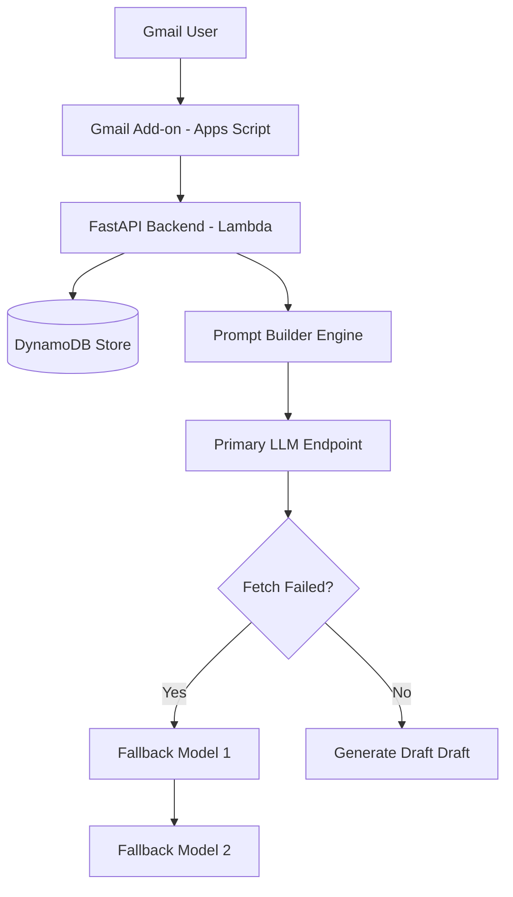
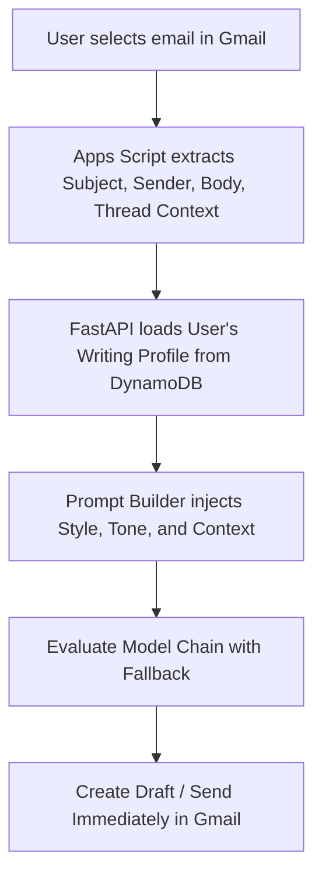

# 1. Hero Section
Title: AI Email Assistant
Tags: Next.js • Google Apps Script • OpenAPI API • AWS Lambda • Web Speech API
Description: Personalized Gmail assistant that generates contextual drafts matching the user's communication style by analyzing historical mail trends.
Github: https://github.com/rupeshdev18/ai-email-assistant
Live: #

# 2. Business Problem
Writing emails consumes significant daily productivity, and generic AI assistants produce generic, dry text that does not match an individual's personal writing style. The objective was to build a Gmail AI assistant that first *learns* the user's communication style (tone, greetings, structure, common phrases) and uses that customized profile to generate drafts, rather than writing copy from scratch.

# 3. My Role
I designed and developed the entire application end-to-end as a **solo developer** (incorporating design reviews and iterations with a senior engineer).

My ownership included:
✔ Developing the **Google Apps Script Gmail Add-on**.
✔ Coding the **Python FastAPI backend**.
✔ Architecting the **Incremental User Profiling Pipeline**.
✔ Creating the **Structured Prompt Builder** and email refinement controls.
✔ Designing the **Multi-model Fallback Strategy** for API resilience.
✔ Integrating DynamoDB database storage and REST hooks.

# 4. Architecture

# 5. Request Flow
**Context-Aware Reply Draft Generation Flow:**

**New Email Composition Flow:**
`Add-on Chat Interface → User Request → Backend Prompt Builder → LLM Generation → Refine (Shorter / Longer / Casual) → Insert Draft`

# 6. Database Design
**Storage Strategy:**
| Table | Partition Key | Fields Stored | Purpose |
|---|---|---|---|
| UserProfiles | `mailId` (String) | Global style, CategoryProfiles (JSON Map), OnboardingStatus | Stores writing profiles per category for key-value retrieval. |

Explain:
We chose DynamoDB because all profile retrievals are keyed directly by the user's `mailId`. DynamoDB offers low-latency key-value lookups, scales horizontally without configuration, and stores the user's category-specific style properties as a flexible JSON document without requiring relational joins.

# 7. Engineering Decisions
ADR-001: Why FastAPI?
- **Problem**: Need highly performant web services in Python to integrate with AI and ML SDKs.
- **Alternatives**: Flask, Node.js.
- **Decision**: FastAPI.
- **Trade-offs**: Lightweight and provides automatic schema validation (Pydantic) for complex email payloads.

ADR-002: Why DynamoDB?
- **Problem**: Storing and fetching unstructured JSON user writing profiles quickly by email address.
- **Alternatives**: PostgreSQL, MongoDB.
- **Decision**: Amazon DynamoDB.
- **Trade-offs**: Limited relational querying, but offers simple key-value scaling with zero maintenance.

ADR-003: Why Incremental User Profiling?
- **Problem**: Fetching and processing 2,000 historical emails during onboarding exceeds LLM context windows and triggers rate limits.
- **Alternatives**: Single prompt processing (impossible due to context size), or offline fine-tuning (expensive and slow).
- **Decision**: Process emails in batches of 50, iteratively passing the previous version to refine the profile.
- **Trade-offs**: Requires more API calls, but stays within context window limits, controls cost, and runs faster.

ADR-004: Why Category-Specific Writing Profiles?
- **Problem**: A single writing style profile dilutes personalization quality (e.g. professional support vs casual personal chat).
- **Alternatives**: One global profile.
- **Decision**: Classify emails into 20 predefined categories (Work, HR, Support, Personal, etc.) and maintain profiles per category.
- **Trade-offs**: Slightly more complex prompt composition, but preserves tone accuracy across different contexts.

ADR-005: Why Multi-Model Fallback Strategy?
- **Problem**: LLM provider outages, rate limits (HTTP 429), or transient network timeouts break draft generation.
- **Alternatives**: Fail immediately.
- **Decision**: Route requests through a sequential model fallback chain (Primary → Fallback 1 → Fallback 2 → Retry with Jitter).
- **Trade-offs**: Added orchestration logic on the backend, but prevents user-facing errors during provider downtime.

# 8. Biggest Challenges
**Biggest Technical Challenge:**
Learning a user's unique writing habits without exceeding LLM context windows or incurring massive token expenses. We resolved this by building an incremental batch profiling pipeline. On onboarding, we read up to 2,000 emails, processed them 50 at a time, and iteratively updated the style profile. This kept the context size predictable, controlled API billing, and allowed the LLM to output a highly refined JSON profile.

# 9. Trade-offs
JSON profile injection vs. LLM fine-tuning:
- **Pros**: Zero training cost, profiles update instantly, and switching model providers does not require rebuilding a model.
- **Cons**: Consumes system context tokens in every API request compared to a fine-tuned endpoint.

Incremental batch processing vs. One-shot profiling:
- **Pros**: Stays safely within provider context windows and keeps requests deterministic.
- **Cons**: Increases the total count of API requests during onboarding.

# 10. Metrics
- ~2,000 Onboarding emails parsed
- 50 Emails processed per batch
- ~20 Predefined email writing categories
- 8s Maximum retry delay cap
- Sub-2s Average reply generation speed

# 11. Screenshots
Optional screenshots of the Gmail add-on panel and style refinement sliders.

# 12. Case Study
### Problem
Generic AI writing assistants produce dry text that sounds robotic. Creating a personalized engine requires extracting style properties from thousands of sent emails.

### Design
Built a serverless FastAPI backend linked to a Gmail Apps Script add-on. Historical data is indexed, grouped, and fed into an incremental LLM analysis loop, storing profiles in DynamoDB.

### Implementation
Structured prompts to inject writing profiles (greetings, lengths, common phrases, tone) alongside original emails. Added refinement buttons (More Formal, More Casual, Shorter, Longer) to rebuild drafts dynamically.

### Reliability & Outages
To handle transient model failures, we built a fallback chain that shifts the request to secondary providers if the primary endpoint returns a 429 or 500 error, ensuring drafts are always generated.

# 13. Improvements
If I rebuilt today:
- **RAG Pipeline**: Use vector embeddings to retrieve representative historical emails for the prompt instead of relying only on summaries.
- **Continuous Profile Updates**: Update profiles incrementally as new drafts are edited and sent instead of a one-time onboarding pass.
- **LangGraph Orchestration**: Utilize LangGraph for multi-step drafting and editing agents.
- **Multilingual Support**: Detect and preserve writing profiles across different languages.

# 14. Interview Questions
Why batch emails 50 at a time?
To fit within model token context limits, prevent API timeouts, and ensure the LLM can output a consistent, detailed style assessment.

Why categorize writing styles into 20 groups?
People write differently depending on the recipient (e.g. professional HR reports vs short personal messages). Categorization keeps these styles isolated and accurate.

How does the fallback system work?
If the primary LLM fails or is rate-limited, the handler catches the exception and routes the prompt to Fallback 1 and Fallback 2 before applying exponential backoff and jitter.

Why use DynamoDB?
Fast, single-key lookups by `mailId` are ideal for DynamoDB, avoiding relational overhead and making profile loading extremely responsive.

# 15. Lessons Learned
- Creating a successful AI product is more about the surrounding infrastructure (profile extraction, fallback chains, rate limiting) than the underlying LLM model itself.
- Incremental batch loops are a highly reliable way to summarize and analyze massive datasets.
- Explicitly injecting user metadata templates into prompts produces better personalization results than complex model fine-tuning.
