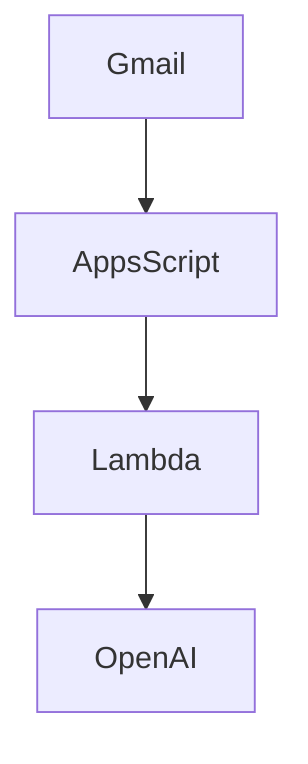
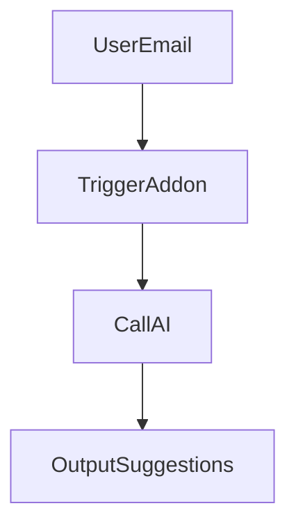

# 1. Hero Section
Title: AI Email Assistant
Tags: Next.js • Google Apps Script • OpenAI API • AWS Lambda • Web Speech API
Description: Developed Gmail add-on using OpenAI APIs to generate context-aware replies with tone customization. Added speech-based input via Web Speech API and deployed backend inference on AWS Lambda.
Github: https://github.com/rupeshdev18/ai-email-assistant
Live: #

# 2. Business Problem
[Template Placeholder]

# 3. My Role
I designed and developed:
✔ AI Prompt Engineering
✔ Google Apps Script plugin
✔ AWS Lambda APIs

# 4. Architecture

# 5. Request Flow

# 6. Database Design
| Table | Description |
|---|---|
| Usage | API billing stats |

# 7. Engineering Decisions
ADR-001: Why AWS Lambda?
- **Problem**: Inference call execution is bursty and serverless keeps cost low.
- **Alternatives**: Dedicated EC2.
- **Decision**: AWS Lambda.

# 8. Biggest Challenges
Challenge:
Response latency.

# 9. Trade-offs
Serverless latency:
- **Pros**: Scales to zero.
- **Cons**: Cold start delays.

# 10. Metrics
- 2000+ Emails Analyzed
- Sub-2s Average reply gen

# 11. Screenshots
Optional screenshots.

# 12. Case Study
### Problem
Detailed story...

# 13. Improvements
If I rebuilt today...

# 14. Interview Questions
How to handle cold starts?
By keeping Lambda warm or using provisioned concurrency.

# 15. Lessons Learned
- Prompt structure directly impacts JSON output consistency.
