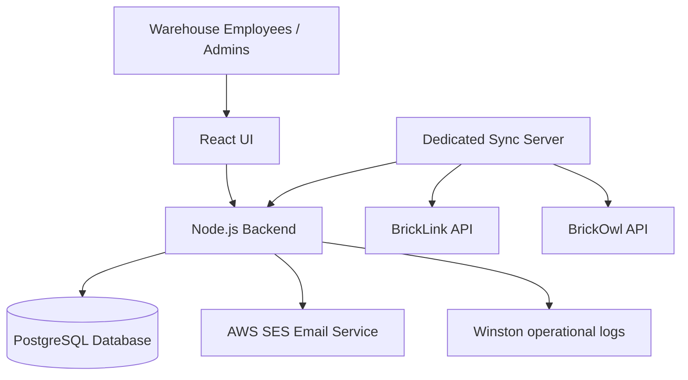
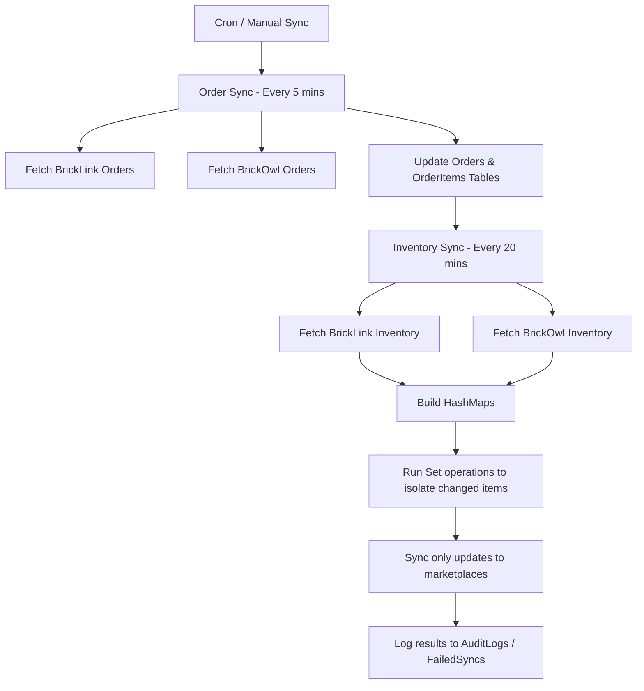

# 1. Hero Section
Title: BrickoSys: Inventory & Warehouse MS
Tags: React • Node.js • PostgreSQL • AWS
Description: Inventory synchronization and warehouse management platform built for one of the largest LEGO sellers in the US.
Github: https://github.com/rupeshdev18/brickosys
Live: #

# 2. Business Problem
**Q: What problem was BrickoSys solving?**
The client sold products simultaneously on BrickLink and BrickOwl. Since both marketplaces managed inventory independently, a sale on one platform could leave stale inventory on the other, resulting in overselling. The objective was to synchronize inventory and orders automatically while also simplifying warehouse operations for employees.

**Q: What were the requirements?**
- Synchronize inventory between BrickLink and BrickOwl.
- Allow either marketplace to be configured as the Primary Store (acting as the source of truth).
- Synchronize orders before inventory.
- Support warehouse order picking.
- Maintain audit logs.
- Notify users when synchronization fails.
- Allow manual synchronization.
- Prevent duplicate marketplace accounts.
- Securely store marketplace API credentials.

# 3. My Role
This was a startup environment without a large engineering team — most engineers owned their own client/project independently rather than working in large shared teams. I developed almost the complete backend independently over approximately **6–8 months** (design reviews were held with a senior engineer along the way).

I designed and developed:
✔ Authentication
✔ Marketplace integrations (BrickLink & BrickOwl APIs)
✔ Synchronization engine
✔ Warehouse APIs (allowing employees to group orders into picking batches filtered by warehouse location)
✔ Audit logging
✔ Failed synchronization handling
✔ AWS SES integration
✔ Scheduling using cron jobs
✔ Inventory reconciliation logic (HashMap & Set comparisons)
✔ Database design
✔ Deployment support

# 4. Architecture

# 5. Request Flow

# 6. Database Design
**Tables:**
| Table | Purpose |
|---|---|
| Users | User accounts, roles, and encrypted marketplace credentials config |
| Orders | Marketplace order records |
| OrderItems | Line items per order |
| FailedSyncs | Failed synchronization records with deep links for manual retry |
| AuditLogs | Business-level action logs visible to users |
| Products | Global catalog of LEGO parts |
| Inventory | Granular inventory levels across warehouses |

**Why Didn't You Normalize?**
From a database design perspective, normalization would have been cleaner. However, the application only supported two marketplaces and around sixty enterprise customers. Adding another table would have increased complexity without providing much practical benefit. If the business expanded to additional marketplaces like Amazon or eBay, I would move marketplace credentials into a dedicated `Stores` table.

# 7. Engineering Decisions
ADR-001: Why JWT?
- **Problem**: Stateless session verification at scale for ~400 employee accounts.
- **Alternatives**: Server-side sessions (Redis / Express Sessions).
- **Decision**: Used JWTs containing non-sensitive user metadata (ID, role, organization, primary store).
- **Trade-offs**: Harder to instantly revoke, but solved backend statelessness and eliminated sticky sessions on load balancers.

ADR-002: Why node-cron?
- **Problem**: Need simple, cost-effective cron scheduling for background synchronization jobs.
- **Alternatives**: AWS EventBridge, BullMQ.
- **Decision**: Used node-cron running on a single dedicated instance.
- **Trade-offs**: Single point of failure if that instance goes down, but perfect for 60 enterprise tenants.

ADR-003: Why Dedicated EC2?
- **Problem**: Inventory reconciliation for 2M+ products is highly CPU-intensive and blocks the main event loop.
- **Alternatives**: Serverless AWS Lambdas.
- **Decision**: Running synchronization jobs on a dedicated EC2 instance separate from the main API instance.
- **Trade-offs**: Pay for idle instance time, but protects user-facing APIs from event loop blocks.

ADR-004: Why HashMap and Set?
- **Problem**: Comparing millions of array elements sequentially takes 20-25 seconds.
- **Alternatives**: Nested linear array search (O(N^2)).
- **Decision**: Map inventories to HashMaps for O(1) lookups and perform Set differences.
- **Trade-offs**: Slightly higher memory overhead, but reduced reconciliation time to 5-10 seconds.

ADR-005: Authentication & API Verification
- **Problem**: How to ensure user registration and credentials validation is secure and robust.
- **Alternatives**: Store credentials in plain text.
- **Decision**: Users verify account through an email verification link. Credentials (BrickLink & BrickOwl API keys) are validated via each marketplace's health-check API and encrypted before storing in the database.
- **Trade-offs**: Inactive accounts (registered but never configured marketplace credentials) are automatically deleted on day 7 via a scheduled cleanup job (with a reminder email sent on day 6).

ADR-006: Throttling & Rate Limits
- **Problem**: BrickOwl allowed around 200 requests/second per API key.
- **Alternatives**: Sequential single-threaded API requests.
- **Decision**: Processed around 100 requests in parallel since average request completed in 800ms.
- **Trade-offs**: High throughput while staying comfortably below the documented rate limit.

ADR-007: Retry Strategy & Failed Sync Handling
- **Problem**: How to handle temporary marketplace API failures.
- **Alternatives**: Fail immediately or retry indefinitely.
- **Decision**: Retried with exponential backoff and jitter (delay up to 8s). If synchronization still failed, we recorded the failure in the `FailedSyncs` table and sent emails via AWS SES.
- **Trade-offs**: Exposes deep links to the marketplace in the UI for users to complete the operation manually.

# 8. Biggest Challenges
**Biggest Technical Challenge:**
The biggest technical challenge was efficiently synchronizing inventories containing more than two million LEGO products per customer. My initial implementation compared inventories more directly, which worked functionally but took around 20–25 seconds just for reconciliation. After profiling the logic, I realized that most products were unchanged between synchronizations. I redesigned the comparison by first normalizing the data into HashMaps and then using Set operations to identify only added, updated, and deleted products. This reduced reconciliation time to around 5–10 seconds and significantly reduced unnecessary processing.

# 9. Trade-offs
Database De-normalization (Stores vs Users):
- **Pros**: Simple schema, fast single-table queries for credentials, low database overhead.
- **Cons**: Refactoring required if additional marketplaces (eBay, Amazon) are added later.

node-cron scheduling:
- **Pros**: Easy to write and run, cheap, no extra infrastructure dependency.
- **Cons**: Harder to scale horizontally across multiple instances without double-running.

# 10. Metrics
- 30 Enterprise Customers
- 400 Employee Users
- 70 Inventory Syncs/Day
- 450 Order Syncs/Day
- 5k-15k Products Synced (Weekdays)
- 20k-40k Products Synced (Weekends)
- 90-120s Full Order Sync duration
- 150-300s Full Inventory Sync duration

# 11. Screenshots
Optional screenshots of the dashboard and picking batches.

# 12. Case Study
### Problem
Overselling was the biggest threat to the seller's reputation and search ranking on BrickLink and BrickOwl. Manual tracking led to a 42% operational overhead.

### Design
Designed a multi-tenant warehouse system in Node.js/PostgreSQL with order-first reconciliation logic. Every 5 minutes we synchronized new orders; every 20 minutes we synchronized inventory.

### Implementation
Developed background synchronization routines that fetch inventories, compare them, and propagate changes, alongside a warehouse order picking interface.

### Challenges
Processing millions of records blocked the Node.js event loop, which we solved by using HashMaps, Set operations, and dedicating a separate EC2 compute instance for sync jobs.

### Toughest Bug
During synchronization, we occasionally saw inventory mismatches between marketplaces. Initially we thought the synchronization logic was incorrect, but after debugging we discovered that inventory synchronization could begin before all recent orders had been processed. That meant inventory calculations were based on stale order data. We solved this by always executing order synchronization before inventory synchronization, ensuring inventory reconciliation always started from the latest order state.

### Production Failure Story
Occasionally, some marketplace API operations failed because of temporary rate limits or network issues. Instead of repeatedly retrying and potentially making the situation worse, we retried with exponential backoff and jitter. If the operation still failed, we recorded it in the `FailedSyncs` table, notified the user through email, and exposed the failure in the UI so it could be resolved manually.

### Biggest Mistake
One mistake I made initially was designing some database tables too quickly without thinking much about future extensibility. During code reviews, a senior engineer suggested that certain parts could be normalized better and also pointed out places where API calls could be executed in parallel using `Promise.all` instead of sequentially. Those suggestions improved both maintainability and performance. Since then, I spend more time thinking about schema design and identifying opportunities for concurrency before implementing a solution.

### What Are You Most Proud Of?
I'm most proud that I was trusted to build almost the entire backend for a production system at an early stage of my career. The project involved multiple third-party integrations, synchronization logic, warehouse workflows, authentication, and background jobs. It was challenging, but it significantly improved my confidence as an engineer because I had to solve real production problems rather than just implement isolated features.

# 13. Improvements
If I rebuilt today:
- Separate stores credentials into a normalized `Stores` table.
- Replace node-cron with a queue-based scheduler (EventBridge + SQS or BullMQ) for better scalability.
- Use distributed locks (like Redlock via Redis) instead of database flags for synchronization control.
- Add richer monitoring with metrics and dashboards.
- Use webhooks instead of polling, if marketplaces support them.

# 14. Interview Questions
Why HashMap/Set?
Linear array comparisons are O(N^2) which bottlenecks with millions of products. HashMaps and Sets reduce comparison complexity to O(N).

Why order sync first?
Orders directly change available inventory. Syncing orders first prevents inventory calculations from running on stale data.

How did you respect rate limits?
We throttled parallel requests to process around 100 parallel calls at 800ms per request, staying safely under BrickOwl's limit of 200 requests/second.

Why JWT?
It eliminated the need for server-side session storage and sticky sessions on load balancers, making the application stateless for around 400 employee accounts.

Why node-cron?
With around 60 enterprise customers on a single synchronization instance, node-cron was simple, reliable, and operationally inexpensive.

Why dedicated EC2?
Inventory synchronization is CPU-intensive because it involves fetching and comparing millions of inventory records. Running those jobs on the application server could impact user-facing APIs.

Why didn't you normalize?
The application only supported two marketplaces and around sixty enterprise customers. Adding another table would have increased complexity without providing much practical benefit.

# 15. Lessons Learned
- This project taught me how different production systems are from college or personal projects. I learned how to work with third-party APIs, respect rate limits, handle retries, design background jobs, build reliable synchronization processes, and think about failure scenarios instead of only the happy path.
- It also taught me that many engineering decisions are trade-offs driven by business requirements rather than purely technical ideals.
