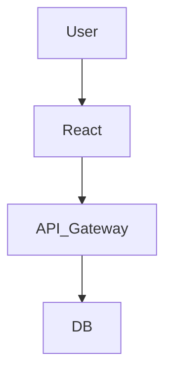
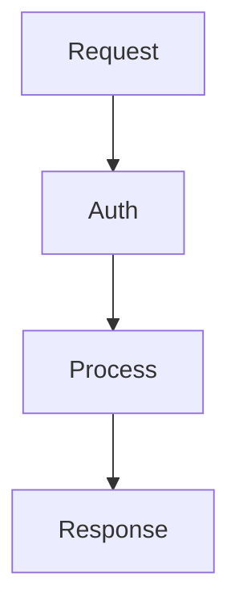

# 1. Hero Section
Title: SiloamHR: Enterprise Multi-Tenant HRMS
Tags: React • Node.js • PostgreSQL • Knex • AWS
Description: Built for 50+ organizations to manage employees, leave workflows, payroll and projects securely.
Github: https://github.com/rupeshdev18/cleardays
Live: https://hr-portal-web-nd7c.onrender.com

# 2. Business Problem
[Template Placeholder - Describe the business problem]

# 3. My Role
I designed and developed:
✔ Backend API Routes
✔ Database Migrations & Seeders
✔ Row-level Security Configuration

# 4. Architecture

# 5. Request Flow

# 6. Database Design
| Table | Description |
|---|---|
| Tenant | Profile metadata |

Explain:
Why we chose this schema layout.

# 7. Engineering Decisions
ADR-001: Why PostgreSQL?
- **Problem**: Need transactional safety and row-level security.
- **Alternatives**: MongoDB.
- **Decision**: PostgreSQL.
- **Trade-offs**: Harder to scale horizontally.

# 8. Biggest Challenges
Challenge:
Handling dynamic workflows.

Solution:
Stored flows in JSONB columns.

# 9. Trade-offs
Shared DB:
- **Pros**: Low cost.
- **Cons**: Security complexity.

# 10. Metrics
- 50+ Tenants
- 500+ Users

# 11. Screenshots
Optional screenshots.

# 12. Case Study
### Problem
Detailed story...
### Design
Architectural details...
### Implementation
Coding details...
### Challenges
Bottlenecks solved...
### Lessons
Lessons...

# 13. Improvements
If I rebuilt today...

# 14. Interview Questions
Why row-level security?
To isolate tenant access at the DB engine layer.

# 15. Lessons Learned
- Real enterprise software is about security.
