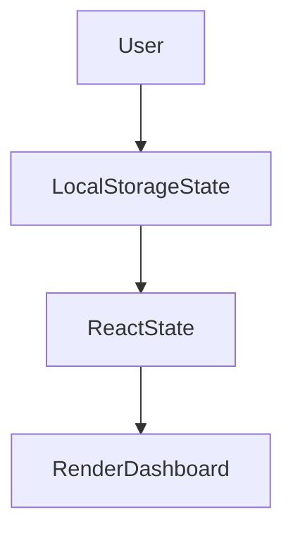
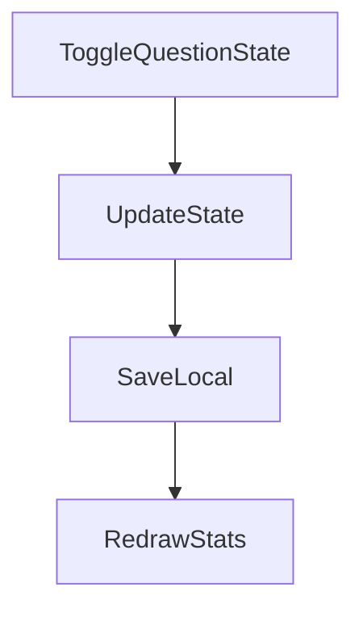

# 1. Hero Section
Title: Interactive DSA Tracker Dashboard
Tags: React • Tailwind CSS • LocalStorage • Algorithms • Progress Metrics
Description: Designed an interactive dashboard tracking 309+ Data Structures & Algorithms coding questions across 22 patterns, offering visual progress breakdowns, filterable stats, and search index.
Github: https://github.com/rupeshdev18/dsa-tracker
Live: #

# 2. Business Problem
[Template Placeholder]

# 3. My Role
I designed and developed:
✔ Category filters
✔ Progress dashboards
✔ State persistence

# 4. Architecture

# 5. Request Flow

# 6. Database Design
| Table | Description |
|---|---|
| QuestionState | LocalStorage key-value pairs |

# 7. Engineering Decisions
ADR-001: Why LocalStorage?
- **Problem**: Need instant stateless persistence without backend login overhead.
- **Alternatives**: PostgreSQL Cloud database.
- **Decision**: LocalStorage API.

# 8. Biggest Challenges
Challenge:
State tracking for hundreds of items efficiently.

# 9. Trade-offs
Client-only state:
- **Pros**: Zero hosting cost, instant latency.
- **Cons**: Device-specific tracking.

# 10. Metrics
- 309+ Questions Tracked
- 22 Algorithmic Patterns

# 11. Screenshots
Optional screenshots.

# 12. Case Study
### Problem
Detailed story...

# 13. Improvements
If I rebuilt today...

# 14. Interview Questions
How to sync local state?
Using browser storage event listeners or cloud integrations.

# 15. Lessons Learned
- Simple architectures are often the most robust.
