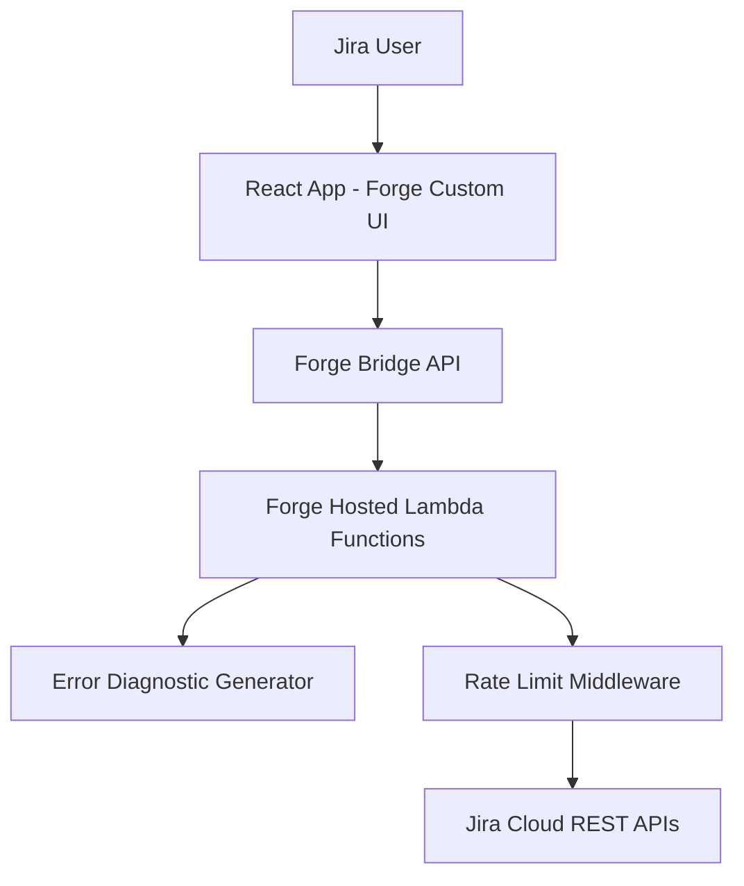
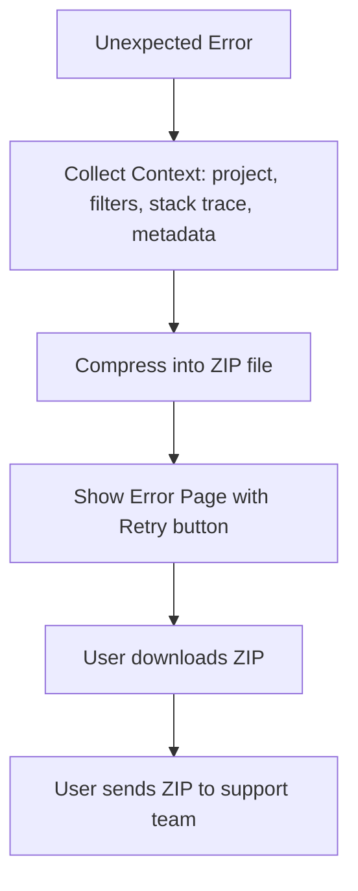
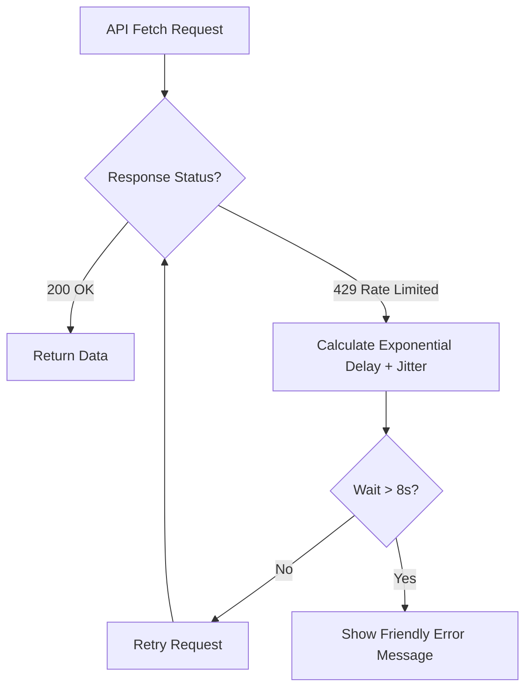

# 1. Hero Section
Title: Jira Enterprise Workflow Plugin
Tags: React • Atlassian Forge • Atlaskit • TypeScript • Jira REST APIs
Description: Reporting plugin built on Atlassian Forge that fetches projects, issues, and filters via Jira APIs, implementing custom diagnostics and rate-limit handling.
Github: https://github.com/rupeshdev18/jira-plugin
Live: #

# 2. Business Problem
The application generates custom reports by fetching large datasets (projects, issues, filters) from Jira via REST APIs. Because the plugin runs inside **Atlassian Forge**, it is subject to strict platform constraints compared to traditional Node.js backends:
- **No access to standard logging/monitoring platforms** (such as Sentry).
- **Strict API rate limiting** from Jira (~100 requests/second).
Without proper handling, report generation for larger enterprise customers frequently failed due to unhandled rate limits, and debugging production errors was nearly impossible.

# 3. My Role
This was a **short, focused engagement (~3–4 weeks)** working on two specific production features within an existing Forge application rather than a ground-up solo build.

My ownership was scoped to:
✔ Designing and implementing the **Error Diagnostic Package Generator**.
✔ Developing the **Jira Rate Limit Handling** and retry algorithms.
✔ Configuring configurable request batching mechanics.

# 4. Architecture

# 5. Request Flow
**Error Diagnostic ZIP Flow:**

**Jira API Retry Flow:**

# 6. Database Design
| Component | Storage Type | Purpose |
|---|---|
| Atlassian Forge Storage | Key-Value Store | Stores user report configurations and active filter settings. |

Explain:
Atlassian Forge plugins run in a secure, isolated sandbox where developers do not host a traditional database. All persistent settings are saved directly using Atlassian's hosted Key-Value Storage APIs to satisfy enterprise security compliance.

# 7. Engineering Decisions
ADR-001: Why Atlassian Forge?
- **Problem**: Deploying and maintaining secure Jira plugins without managing server infrastructure.
- **Alternatives**: Atlassian Connect (hosted on AWS/Heroku).
- **Decision**: Atlassian Forge.
- **Trade-offs**: Severe platform restrictions (no Sentry, strict runtime limits), but guarantees enterprise security compliance and zero server maintenance.

ADR-002: Error Diagnostic ZIP Generation
- **Problem**: Traditional monitoring solutions (e.g. Sentry) cannot execute inside the secure Forge sandboxed environment, leaving support teams with no visibility into user errors.
- **Alternatives**: Direct error logging to console (difficult for customers to capture and share).
- **Decision**: Bundled error logs, issue metadata, filter config, and stack traces into a downloadable ZIP file on the error UI.
- **Trade-offs**: Requires manual customer interaction to send the file to support, but secures debugging context under strict platform boundaries.

ADR-003: Exponential Backoff with Jitter
- **Problem**: Multiple parallel requests during report generation hit Jira's 100 req/s rate limits simultaneously, resulting in query failures.
- **Alternatives**: Instant retry or fixed-interval retries.
- **Decision**: Exponential backoff with random jitter capped at a maximum 8-second delay.
- **Trade-offs**: Increases total report generation duration during rate limits, but successfully recovers transient failures and prevents "retry storms."

ADR-004: Configurable Batch Sizes
- **Problem**: Firing too many parallel requests triggers rate limits too quickly.
- **Alternatives**: Hardcoded small batch size.
- **Decision**: Allowed users to configure report batch sizes (10, 20, 50, or 100) to balance retrieval speed against api load.
- **Trade-offs**: Requires user awareness of their Jira account size, but provides flexibility for small vs large organizations.

# 8. Biggest Challenges
**Biggest Technical Challenge:**
Debugging and monitoring client-side errors without traditional APM tools. When report rendering failed, we had no access to client console logs or exception tracing. Implementing the client-side diagnostic bundler required intercepting exceptions at the top-level React Error Boundary and capturing the active React state, project metadata, and filter variables, then compressing them dynamically into a readable JSON file zipped in-browser for the customer to download.

# 9. Trade-offs
| Approach | Advantage | Disadvantage |
|---|---|---|
| Large parallel batch size | Faster report generation for small Jira databases | Higher chance of hitting rate limits on larger repositories |
| Small batch size | High stability, low rate-limit probability | Significantly slower report generation times |
| Exponential backoff (with jitter) | Prevents retry storms, increases request success rate | Increases overall execution time under high load |

# 10. Metrics
- ~20–28 Days Development Duration
- ~100 requests/second Atlassian API rate limit
- 10 / 20 / 50 / 100 Configurable parallel batch sizes
- 8s Maximum retry delay cap
- 2 Production Features Shipped

# 11. Screenshots
Optional screenshots of the report configuration and diagnostic download screens.

# 12. Case Study
### Problem
Jira plugins run inside the Atlassian Forge sandbox where typical third-party monitoring (like Sentry) is blocked due to security controls. Rate limiting from parallel REST API calls also broke report generation for large accounts.

### Design
Designed a local diagnostics bundler that catches exceptions within a custom React Error Boundary, coupled with a rate-limit wrapper that intercept HTTP 429 statuses and manages backoff schedules.

### Implementation
Implemented in TypeScript using Atlaskit UI components. The rate-limit handler catches 429s, updates the UI loader to inform the user that fetching is retrying, and schedules retries with backoff and jitter. The diagnostic engine collects stack traces and configs and formats them into a download link.

### Platform Engineering
Unlike building standalone applications where you can introduce any database or logger, working inside Atlassian Forge is an exercise in engineering under constraints. We successfully adapted to these platform controls while preserving an intuitive user experience.

# 13. Improvements
If I rebuilt today:
- **Dynamic Batch Resizing**: Automatically adjust batch size downward (e.g. from 100 to 50) when HTTP 429 rate limit responses are detected, and scale back up when success rates stabilize.
- **Circuit Breakers**: Implement a circuit breaker pattern to cancel report fetching early if repeated retries fail, preventing excessive calls.
- **Data Sanitization**: Ensure sensitive user identifiers or corporate details are automatically scrubbed from the diagnostic JSON before ZIP packaging.

# 14. Interview Questions
What is Atlassian Forge?
Forge is Atlassian's serverless development platform for building secure Jira/Confluence apps, hosting both frontends and backend Lambda environments.

Why couldn't you use Sentry?
Forge imposes strict content security policies (CSP) and execution sandbox limits that block external monitoring libraries from tracking code execution.

Why use exponential backoff and jitter?
Exponential backoff delays each retry increasingly to give Jira APIs time to recover. Jitter randomizes these delays to prevent multiple parallel client retries from hitting the server in sync.

Why show a loader instead of failing immediately?
Since most 429 errors resolve after a few retries, keeping the loader active keeps the user in the flow rather than throwing a false error.

# 15. Lessons Learned
- SaaS platform development requires working alongside platform constraints rather than fighting them.
- Graceful degradation (retry states and diagnostics) significantly improves perceived application quality.
- Providing retry buttons and loaders has a massive impact on user experience during API outages.
