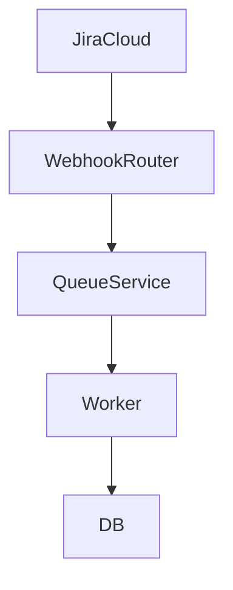
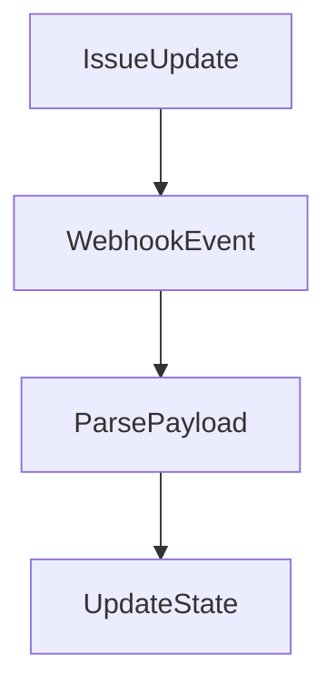

# 1. Hero Section
Title: Jira Enterprise Workflow Plugin
Tags: React • Node.js • Playwright • Atlassian SDK • CI/CD
Description: Architected a high-throughput Jira integration plugin processing 60K+ active issues, tracking custom workflow states, and achieving 87% Playwright end-to-end branch coverage.
Github: https://github.com/rupeshdev18/jira-plugin
Live: #

# 2. Business Problem
[Template Placeholder]

# 3. My Role
I designed and developed:
✔ Jira SDK Connectors
✔ Playwright E2E Tests
✔ Backend sync routing

# 4. Architecture

# 5. Request Flow

# 6. Database Design
| Table | Description |
|---|---|
| Issues | Workflow state logs |

# 7. Engineering Decisions
ADR-001: Why Playwright for testing?
- **Problem**: Need highly reliable testing for complex iframe SDK components.
- **Alternatives**: Cypress, Selenium.
- **Decision**: Playwright.

# 8. Biggest Challenges
Challenge:
Handling 60K+ concurrent issue hooks.

# 9. Trade-offs
Webhook throttling:
- **Pros**: Protects backend database.
- **Cons**: Introduce state latency.

# 10. Metrics
- 60k+ Issues Processed
- 87% Playwright Test Coverage

# 11. Screenshots
Optional screenshots.

# 12. Case Study
### Problem
Detailed story...

# 13. Improvements
If I rebuilt today...

# 14. Interview Questions
How to test Jira apps locally?
Using Atlassian Connect local tunneling.

# 15. Lessons Learned
- External platforms require robust retry safety nets.
