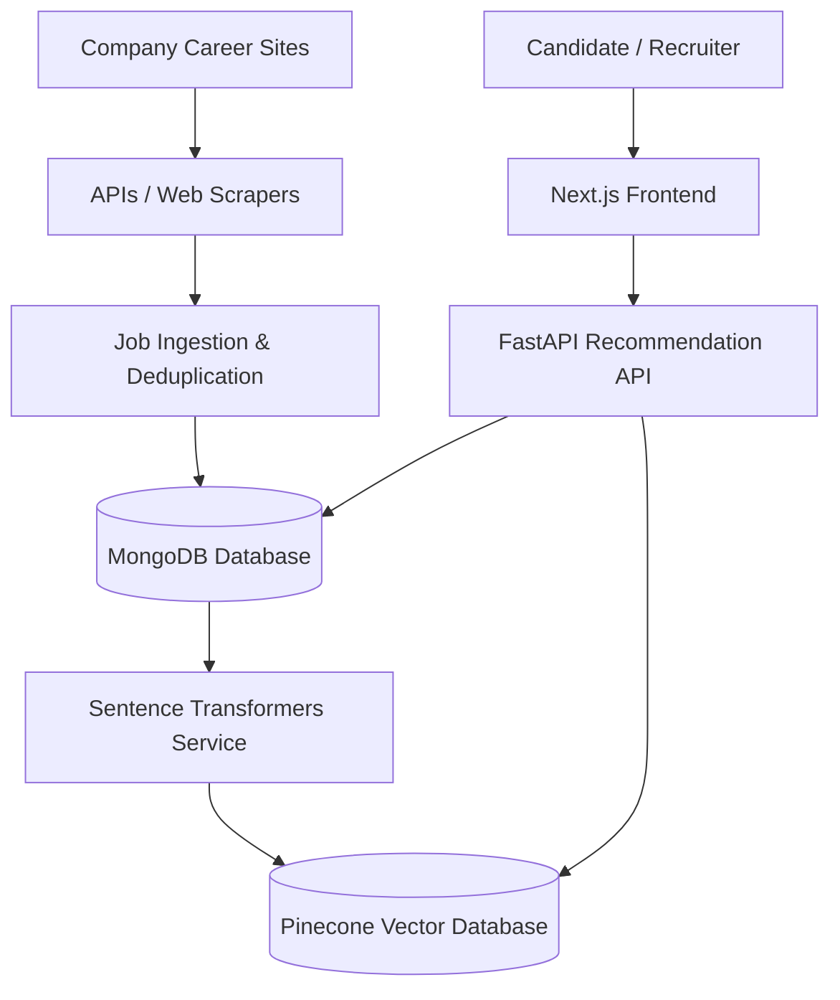
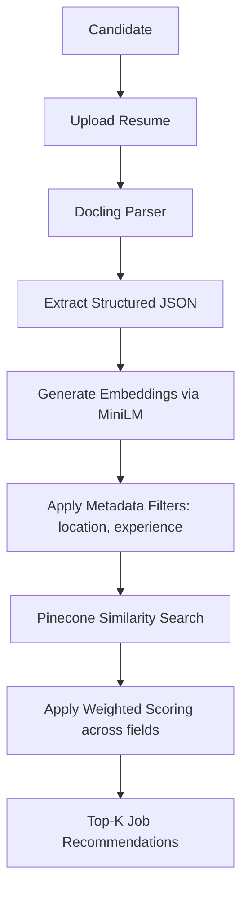
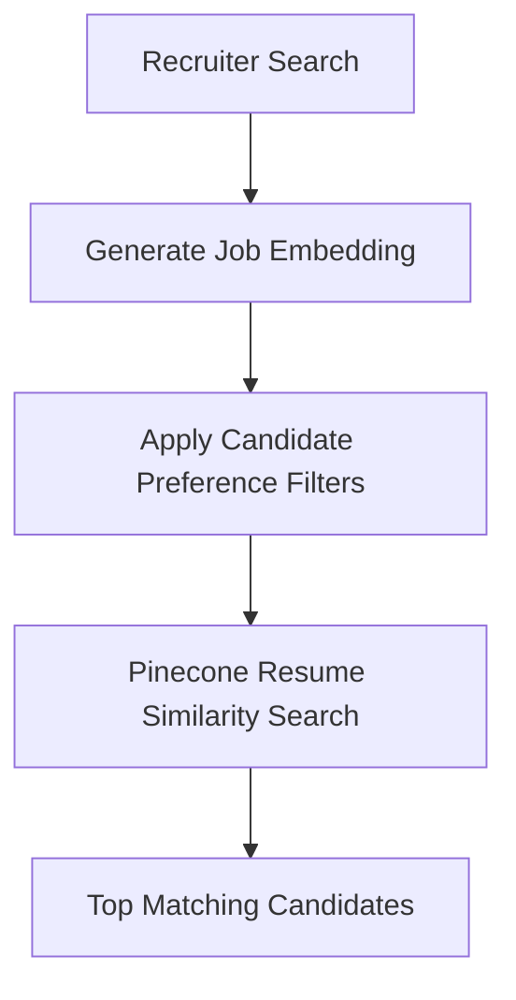

# 1. Hero Section
Title: Lobby Network: Job Search Platform
Tags: Next.js • Node.js • MongoDB • Python • FastAPI • Pinecone
Description: AI-powered job recommendation platform built for the US healthcare industry to match candidates and recruiters semantically.
Github: https://github.com/rupeshdev18/lobby-network
Live: #

# 2. Business Problem
**Q: What problem was Lobby Network solving?**
Healthcare professionals in the US had to search multiple company career portals manually to find relevant opportunities. Recruiters similarly had difficulty identifying suitable candidates from large applicant pools. The platform centralized job listings, automatically processed resumes, and used semantic search to recommend the most relevant jobs and candidates.

**Q: What were the requirements?**
- Aggregate jobs from ~250 healthcare companies nightly.
- Prefer official APIs over web scraping.
- Parse uploaded resumes into structured data.
- Generate semantic embeddings for jobs and resumes.
- Store operational data separately from vector search data.
- Recommend relevant jobs based on candidate preferences.
- Recommend suitable candidates to recruiters.
- Support semantic search instead of keyword-only search.

# 3. My Role
This was a **team of 4 engineers**. My ownership was scoped specifically to the **resume parsing and recommendation pipeline**:
✔ Built the FastAPI services for resume processing and embedding generation.
✔ Implemented vector storage in Pinecone with metadata.
✔ Built the metadata filtering logic.
✔ Built the semantic recommendation logic (used for both candidate→job and recruiter→candidate matching).
✔ Additionally built **3–4 company career-portal scrapers**.

Other team members owned the majority of the scraping infrastructure and the frontend.

# 4. Architecture

# 5. Request Flow
**Candidate Recommendation Flow (Candidate → Jobs):**

**Recruiter Recommendation Flow (Recruiter → Candidates):**

# 6. Database Design
**Why MongoDB + Pinecone?**
MongoDB stored complete job information, application data, and operational records. Pinecone was used specifically for vector similarity search since it's optimized for semantic retrieval. Separate databases let each system do the job it was designed for.

| Database | Data Stored | Purpose |
|---|---|
| MongoDB | Complete job info, application data, profiles, and operational logs | Relational & Operational Storage |
| Pinecone | Normalized job and resume embeddings + query metadata | High-speed Vector Similarity Index |

# 7. Engineering Decisions
ADR-001: Why FastAPI?
- **Problem**: Need highly performant web services in Python to integrate with AI and NLP libraries.
- **Alternatives**: Node.js, Flask.
- **Decision**: FastAPI.
- **Trade-offs**: Requires running separate services alongside Node.js, but handles asynchronous AI requests with high performance.

ADR-002: Why Docling over PyPDF2?
- **Problem**: PyPDF2 struggled with complex resume layouts (tables, double columns) and produced inconsistent texts.
- **Alternatives**: PyPDF2, PDFminer.
- **Decision**: Switched to Docling.
- **Trade-offs**: Slightly slower parsing time, but produced highly structured text yielding much cleaner downstream vector embeddings.

ADR-003: Why Pinecone?
- **Problem**: Need managed, highly scalable vector index searching for jobs and candidates.
- **Alternatives**: pgvector in PostgreSQL, FAISS local indices.
- **Decision**: Pinecone.
- **Trade-offs**: Adds an external SaaS dependency and billing, but handles instant metadata filtering and semantic search out-of-the-box.

ADR-004: Why all-MiniLM-L6-v2?
- **Problem**: Choose an embedding model with high semantic representation and minimal latency.
- **Alternatives**: OpenAI text-embedding-ada-002, HuggingFace MPNet.
- **Decision**: sentence-transformers model `all-MiniLM-L6-v2`.
- **Trade-offs**: Shorter context window than larger models, but offers a great balance of embedding quality and CPU-based inference speed.

ADR-005: Why Metadata Filtering Before Search?
- **Problem**: Semantic search without constraints returns jobs that candidates aren't qualified for.
- **Alternatives**: Post-query filtering.
- **Decision**: Filter metadata first (location, experience, preferences) to reduce search space before vector search.
- **Trade-offs**: Requires keeping metadata in sync between MongoDB and Pinecone, but drastically improves match relevance and performance.

ADR-006: APIs vs Scrapers
- **Problem**: Scraping career portals is highly unstable and breaks when HTML structures change.
- **Alternatives**: Scrape everything.
- **Decision**: Prefer official APIs wherever available. Use scrapers only as a fallback.
- **Trade-offs**: Limits candidate platforms to those with APIs, but greatly reduces maintenance overhead.

# 8. Biggest Challenges
**Biggest Technical Challenge:**
Improving recommendation quality. Initially, semantically similar resumes didn't always produce relevant job recommendations because resume data contained noise and inconsistent formatting. This was improved by switching from PyPDF2 to Docling, introducing metadata filtering before vector search, and applying weighted scoring across resume sections (giving different weights to experience, skills, and summary).

# 9. Trade-offs
APIs over Scraping:
- **Pros**: Stable, structured data feeds, zero maintenance on layout updates.
- **Cons**: Restricted by rate limits or paywalls on some platforms.

MongoDB + Pinecone architecture:
- **Pros**: Decouples operational database from compute-heavy vector matching search space.
- **Cons**: Increased complexity maintaining database consistency across both datastores.

# 10. Metrics
- 250+ Company Career Portals targeted
- Nightly Ingestion Cadence
- 4 Team Engineers
- 3-4 Personal Scraper Integrations
- Sub-2s Average query recommendation speed

# 11. Screenshots
Optional screenshots of the job recommendation feed and candidate matches.

# 12. Case Study
### Problem
Centralizing job discovery for US healthcare professionals. Scraping and parsing resumes accurately is highly error-prone due to varying document styles.

### Design
Built a decoupled architecture where jobs are scraped, normalized, stored in MongoDB, and embedded into Pinecone, while FastAPI coordinates resume parsing and recommendations.

### Implementation
Implemented document ingestion pipelines using Docling and FastAPI, generating vector embeddings with Sentence Transformers and loading them into Pinecone.

### Challenges
Weighted matching was required because simply matching embeddings of whole documents returned noisy results. We implemented custom weights favoring the candidate's core skills and experience sections.

### Biggest Mistake
Early on, we focused mainly on semantic similarity and underestimated the importance of metadata filtering. This caused some irrelevant recommendations (e.g. matching senior roles to junior candidates) even when embeddings were semantically close. Adding metadata filtering first resolved this.

### Production Bug
Initially duplicate jobs occasionally appeared because different companies exposed the same position through multiple endpoints.

**Solution:**
Normalized job titles and compared hashes before insertion.

# 13. Improvements
If I rebuilt today:
- Experiment with newer embedding models like `text-embedding-3`.
- Introduce hybrid search (matching BM25 keyword search with dense vector search) for better results on exact job titles.
- Add user feedback loop for active recommendation learning.
- Improve metadata normalization.
- Add observability dashboards to monitor precision/recall metrics.

# 14. Interview Questions
Why Docling?
Docling provides layout-aware parsing (capturing double columns and tables) which produces much cleaner, structured text for downstream embeddings than basic libraries.

Why Pinecone over pgvector?
Pinecone is a dedicated, fully managed vector database optimized for real-time similarity search at scale, offering low-latency metadata filtering out of the box.

Why metadata filtering before vector search?
Pre-filtering reduces the vector search space, ensuring similarity matches are only run on candidates who actually meet the location and experience constraints, speeding up query latency.

What embedding model did you choose?
`all-MiniLM-L6-v2` because it is highly efficient to run on CPU servers and delivers excellent semantic quality.

How did the recruiter match work?
The exact pipeline was run in reverse: we embedded the job description and compared it against the resume embeddings database, applying recruiter search filters first.

How did deduplication work?
During ingestion, job titles and description hashes were compared in MongoDB to skip identical duplicates.

# 15. Lessons Learned
- Recommendation quality starts with clean input data; better structured data and preprocessing produce larger improvements than changing similarity algorithms.
- Semantic search must be combined with structured metadata filtering to prevent irrelevant matches.
- Separating operational data from vector search data simplifies database scaling.
