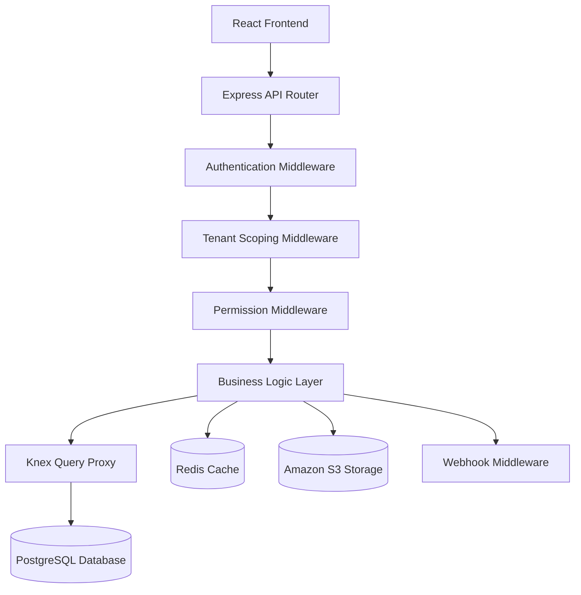
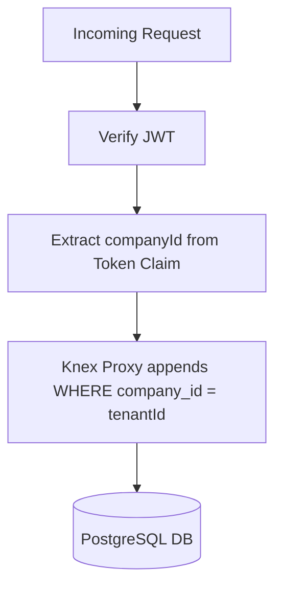
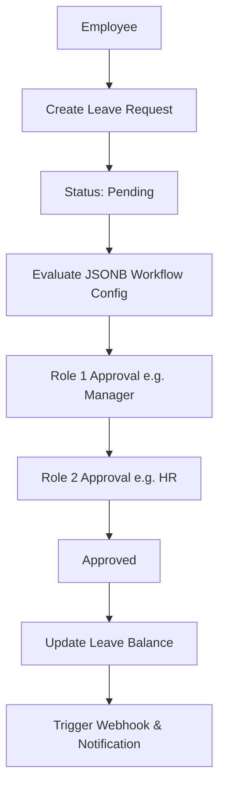

# 1. Hero Section
Title: SiloamHR: Enterprise Multi-Tenant HRMS
Tags: Node.js • Express • Knex.js • PostgreSQL • React • Redis • S3
Description: Configurable SaaS HR platform built to manage employee directories, approval workflows, payroll, and tasks with strict row-level database isolation.
Github: https://github.com/rupeshdev18/siloamhr
Live: https://hr-portal-web-nd7c.onrender.com

# 2. Business Problem
Traditional HR systems are often expensive, difficult to customize, and lack proper tenant isolation. SiloamHR was designed as a SaaS HR platform where each company can manage employees independently while sharing the same infrastructure.

**Q: What were the requirements?**
- Isolated data per organization within a shared PostgreSQL database.
- Fully configurable leave approval chains (no hardcoded approval hierarchies).
- Employee directory, team assignments, and permission matrices.
- Project boards and task workflows (Todo → In Progress → Review → Completed).
- Payroll components and PF calculations (12% of basic salary).
- Secure document storage via S3 pre-signed URLs.
- External webhook delivery and audit logging.
- Soft deletion with configurable retention (default 7 days).

# 3. My Role
I designed and built the entire application end-to-end as a **solo developer** (leveraging design feedback loops from a senior engineer). 

My ownership included:
✔ Designing overall backend architecture
✔ Developing the Node.js + Express backend
✔ Designing the PostgreSQL schema using Knex
✔ Implemented JWT authentication & refresh token rotation in HttpOnly cookies
✔ Implemented multi-tenancy middleware
✔ Designed RBAC + ABAC authorization
✔ Built the leave workflow engine
✔ Built project & task modules
✔ Implemented soft delete with automated cron cleanup
✔ Integrated S3 pre-signed uploads
✔ Built webhook infrastructure as middleware
✔ Wrote Jest unit tests and Playwright E2E tests
✔ Built the complete React frontend

# 4. Architecture

**Authentication Flow:**
`Register → Login → Access Token (15 min) → Refresh Token (7 days) → HttpOnly Cookie → SameSite=Lax`

# 5. Request Flow
**Multi-Tenant Query Scoping:**

**Configurable Leave Request Lifecycle:**

**S3 Document Upload Flow:**
`Client → Backend → Generate Pre-signed URL → Client uploads directly to S3 → Success`

**Soft Delete Flow:**
`Delete Request → Mark Deleted → Hidden from UI → 7-30 Day Retention Period → Cron Job → Permanent Delete`

# 6. Database Design
**Major Tables:**
| Table | Purpose |
|---|---|
| companies | Tenant record |
| users | Employee/user accounts |
| roles | Role definitions |
| permissions | Permission definitions |
| projects | Projects |
| tasks | Task tracking |
| leaves | Leave requests |
| workflows | JSONB-based approval workflow config |
| salary_components | Payroll components (Basic, HRA, etc.) |
| payroll_runs | Payroll execution records |
| notifications | Notification records |
| audit_logs | Business action history |
| api_keys | External API access keys |
| documents | Document metadata (S3-backed) |

**Why didn't you normalize the workflow into multiple relational tables?**
The workflow structure changes frequently and differs per organization. Storing it as JSONB allowed us to support arbitrary, nested approval chains (e.g. Employee → TL → Manager → HR vs. Employee → HR) without introducing multiple relational tables and constant migrations.

# 7. Engineering Decisions
ADR-001: Shared DB over DB-per-tenant / schema-per-tenant
- **Problem**: Lower operational cost and simple deployment for SMB SaaS.
- **Alternatives**: Database-per-tenant or Schema-per-tenant.
- **Decision**: Shared database where every table contains a `company_id`.
- **Trade-offs**: Requires strict query scoping discipline (solved via Knex proxy scoping) to prevent cross-tenant data leaks.

ADR-002: JWT for Authentication
- **Problem**: Session storage bottlenecks and load balancer sticky session requirements.
- **Alternatives**: Redis session storage.
- **Decision**: Access and refresh tokens stored securely.
- **Trade-offs**: Token revocation is harder, but backend scales stateless.

ADR-003: Refresh Tokens in HttpOnly Cookies
- **Problem**: Access tokens expire every 15 minutes. How to avoid forcing re-login?
- **Alternatives**: Store refresh tokens in LocalStorage.
- **Decision**: HttpOnly, SameSite=Lax cookies for refresh tokens.
- **Trade-offs**: Added complexity managing token rotation, but provides high security against XSS and CSRF.

ADR-004: JSONB for Workflows
- **Problem**: Highly customizable leave approval chains required per customer.
- **Alternatives**: Relational tables mapping steps.
- **Decision**: Config-driven workflows stored as JSONB.
- **Trade-offs**: Slightly more complex runtime evaluation logic, but zero migrations needed for workflow updates.

ADR-005: Pre-signed S3 URLs
- **Problem**: Document uploading proxying consumes server bandwidth and bottlenecks memory.
- **Alternatives**: Proxy uploads through Express server.
- **Decision**: Pre-signed S3 URLs.
- **Trade-offs**: Client handles upload directly (saving bandwidth), but requires managing expiration times.

ADR-006: Polling over WebSockets
- **Problem**: Need to sync HR notifications without real-time overhead.
- **Alternatives**: Socket.io / WebSockets.
- **Decision**: Short-interval polling (15 seconds).
- **Trade-offs**: Not suited for instant real-time apps, but simple, light on server resources, and sufficient for HR logs.

ADR-007: Soft Delete with Cron Cleanup
- **Problem**: Prevent accidental data loss and preserve audit history.
- **Alternatives**: Hard delete immediately.
- **Decision**: Mark records as deleted, retain for 7-30 days, then purge via cron.
- **Trade-offs**: Additional storage overhead, but allows recovery and preserves audit trails.

ADR-008: Webhooks as Middleware
- **Problem**: Decouple business modules from external system webhook triggers.
- **Alternatives**: Call webhook triggers directly inside controllers.
- **Decision**: Implemented as Express middleware.
- **Trade-offs**: Business modules stay completely unaware of webhook delivery logic.

# 8. Biggest Challenges
**Biggest Technical Challenge:**
Designing a reusable, secure authorization system that handles both Role-Based (RBAC) and Attribute-Based (ABAC) checks. Initially, controllers manually verified permissions, leading to duplicate code and security oversights. Resolving this meant moving permission checks into reusable Express middleware and routing queries through a Knex proxy wrapper. This ensured company and permission scopes were applied automatically to every DB query.

# 9. Trade-offs
Shared Database Model:
- **Pros**: Cheap, simple backups, fast single-node queries.
- **Cons**: Strict database tenant isolation is critical; noisy neighbor database loads can affect all tenants.

JSONB workflow storage:
- **Pros**: Dynamic runtime configuration, zero database migration churn.
- **Cons**: Complex query syntax for analytics and reporting on workflow paths.

# 10. Metrics
- 50+ Multi-Tenant Organizations
- 500+ Active Employees
- Thousands of Leave Requests processed
- 15 min Access Token lifetime
- 15s Polling Interval
- 7-30 days Soft Delete retention

# 11. Screenshots
Optional screenshots of the admin workflow builder and team directory.

# 12. Case Study
### Problem
Custom approval flows are required for almost every corporate client. Hardcoding these rules (Employee → Manager → HR) forces database refactoring and code deployment for every new tenant.

### Design
Architected a shared-database PostgreSQL structure where workflows are represented as configuration trees inside JSONB. We combined this with a centralized JWT validation and company scoping middleware.

### Implementation
Developed the dynamic leave evaluation engine in Node.js, parsing the active tenant's JSONB workflow steps at runtime. Built the frontend React interfaces to allow Admins to drag-and-drop workflow steps.

### Challenges
To secure files, we bypassed the Express server for document uploads, implementing pre-signed S3 endpoints where the React client uploads directly to S3 bucket storage.

### Failure & Redesign
Initially, our approval logic was hardcoded. Client onboarding stalled because organizations demanded custom paths. We stopped development, restructured the database schema to use JSONB, and rebuilt the workflow engine to evaluate approval steps dynamically at runtime.

# 13. Improvements
If I rebuilt today:
- **Approval Engine**: Move approval processing to background queues (BullMQ + Redis) instead of synchronous requests.
- **Notifications**: Upgrade from polling to Server-Sent Events (SSE) or WebSockets if real-time needs increase.
- **Observability**: Store before/after change states in AuditLogs for easier debugging.
- **API Keys**: Add usage analytics, rate-limiting, and automated secret rotation.
- **Document Scopes**: Add automated virus scanning and preview generation.

# 14. Interview Questions
Why JWT over session cookies?
JWT is stateless, enabling easy horizontal scaling without maintaining session states in Redis or relying on sticky load balancers.

Why HttpOnly on cookies?
HttpOnly cookies cannot be accessed via JavaScript APIs (`document.cookie`), preventing Cross-Site Scripting (XSS) attacks from stealing tokens.

Why SameSite=Lax?
SameSite=Lax prevents CSRF attacks by ensuring cookies are not sent on cross-site requests (except for safe top-level navigations).

How does tenant isolation work?
The backend derives the `companyId` entirely from the validated JWT claims. This is set as `req.companyId` and automatically appended to every Knex database query, preventing developers from forgetting the tenant filter.

Why pre-signed S3 URLs?
Proxying files through the backend wastes server bandwidth and RAM. Pre-signed URLs let clients upload directly to S3 securely while keeping the backend stateless.

How do webhooks work?
We implemented webhook delivery as Express middleware. When business actions complete, the middleware looks up registered endpoints and posts the payload asynchronously, keeping modules loosely coupled.

# 15. Lessons Learned
- Enterprise systems are defined by security, authorization, and configurability—not CRUD.
- Building configurable systems up front (like JSONB workflows) saves significant developer effort as the business scales.
- Bypassing backend bandwidth with pre-signed uploads is essential for keeping server overhead predictable.
