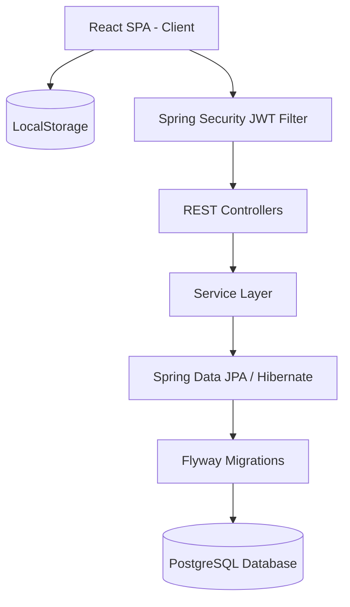
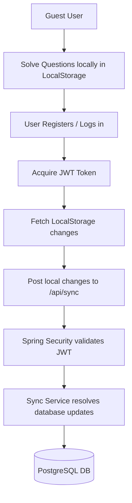

# 1. Hero Section
Title: Interactive DSA Tracker Dashboard
Tags: React • Vite • TailwindCSS • Spring Boot • Spring Security • PostgreSQL • Flyway
Description: Full-stack interview preparation system organizing 309 questions across 22 patterns, with system design notes, STAR interview templates, and offline-first state sync.
Github: https://github.com/rupeshdev18/dsa-tracker
Live: #

# 2. Business Problem
Preparing for software engineering interviews is highly scattered. Candidates must juggle LeetCode, Notion workspaces, system design PDFs, behavioral STAR logs, and local checklists. This fragmentation makes it difficult to track overall patterns, schedule revisions, or share progress. I built this application to unify DSA roadmap progression, system design references, and behavioral answers into a single, cohesive developer workspace.

**Q: What were the requirements?**
- Structured DSA curriculum with 309 questions across 22 patterns.
- Three-state progress tracking (Solved, Revision, Unsolved).
- Notes engine for key insights, complexity analysis, and trick cases.
- Command-style palette search for rapid keyboard-only navigation.
- Public developer profiles shareable via `/profile/{username}`.
- System Design Studio for HLD/LLD references.
- Behavioral prep template using the STAR method.
- Offline-first tracking allowing guest users to save progress locally and sync after logging in.

# 3. My Role
I designed and developed the entire application end-to-end as a **solo developer** to learn the Spring Boot ecosystem deeply. Rather than building a toy project from a tutorial, I built a tool that I personally use, which forced real architectural decisions around security, relational modeling, and state synchronization.

My ownership included:
✔ Designing the Spring Boot backend architecture and REST APIs.
✔ Implementing the Spring Security JWT filter pipeline.
✔ Modeling the database schema and versioning it using Flyway.
✔ Developing the React single-page app and Tailwind CSS UI.
✔ Designing the offline-first LocalStorage synchronization mechanism.

# 4. Architecture

# 5. Request Flow
**Offline-to-Cloud Progress Synchronization:**

**Behavioral STAR Form Submission Flow:**
`React UI → Enter STAR details (Situation, Task, Action, Result) → JSON API Request → Controller → DB Save`

# 6. Database Design
**Major Tables:**
| Table | Purpose |
|---|---|
| users | User credentials, roles, and statistics |
| questions | Catalog of 309 questions, patterns, and stages |
| user_progress | Link table storing user status (Solved, Revision, Unsolved) per question |
| notes | User-submitted coding notes per question |
| star_stories | Behavioral answers mapped to STAR fields |
| system_design_notes | HLD/LLD study reference articles |

**Flyway Schema Management:**
Schema migrations are handled entirely via Flyway (e.g. `V1__init_schema.sql`, `V2__add_revision_flag.sql`). This ensures consistent, version-controlled database updates across local development and production environments.

# 7. Engineering Decisions
ADR-001: Why Spring Boot & Spring Data JPA?
- **Problem**: Building a reliable, type-safe API backend with robust ORM integration.
- **Alternatives**: Node.js (Express), Go.
- **Decision**: Spring Boot 3 + Spring Data JPA/Hibernate.
- **Trade-offs**: More boilerplate and memory footprint than Node.js, but offers enterprise-grade validation, Dependency Injection, and type safety.

ADR-002: Why Flyway Database Migrations?
- **Problem**: Managing database schema changes across multiple dev/prod instances without data loss.
- **Alternatives**: JPA Hibernate auto-ddl update.
- **Decision**: Flyway migrations.
- **Trade-offs**: Requires writing manual SQL migration scripts, but guarantees reproducible databases.

ADR-003: Why Offline-First LocalStorage Sync?
- **Problem**: Onboarding friction; developers often want to try an app before committing to registration.
- **Alternatives**: Block anonymous users from tracking.
- **Decision**: Store solves in client LocalStorage and push a batch sync request upon login.
- **Trade-offs**: Adds complexity handling conflicts if the user updates progress from multiple devices offline.

ADR-004: Three-State Progress Tracking
- **Problem**: Simple binary (solved/unsolved) progress tracking fails to reflect real learning cycles.
- **Alternatives**: Binary checkbox.
- **Decision**: Implemented "Solved", "Revision", and "Unsolved" states.
- **Trade-offs**: Requires more complex database tracking, but allows users to flag questions that need spacing repetition.

ADR-005: Pattern-Based Learning Roadmap
- **Problem**: Randomly solving questions leads to poor concept retention.
- **Alternatives**: Simple list of questions.
- **Decision**: Structured curriculum of 309 questions across 22 patterns (Sliding Window, Two Pointers, HashMap, etc.) and 6 phases.
- **Trade-offs**: Less flexibile than arbitrary playlists, but significantly improves pattern recognition.

# 8. Biggest Challenges
**Biggest Technical Challenge:**
Transitioning from standard Node.js patterns to Java/Spring Boot paradigms. Understanding the Spring Security filter chain—specifically intercepting requests, extracting JWT authorization headers, validating claims, and populating the security context context—was a major learning curve. I resolved this by reading Spring Security specifications, building custom filters, and testing authorization boundaries under different security configurations.

# 9. Trade-offs
PostgreSQL vs. Document DB (MongoDB):
- **Pros**: Relational structure guarantees strict integrity between users, questions, and notes via ACID transactions.
- **Cons**: Requires schema migrations (managed via Flyway) when additions are made.

JWT stateless auth vs. Session cookies:
- **Pros**: Simplifies server architecture and scales stateless.
- **Cons**: Immediate JWT revocation is harder without maintaining a blacklist.

# 10. Metrics
- 309 Curriculum Questions Tracked
- 22 Algorithmic Patterns
- 6 Learning Stages
- 3 Progress States (Solved / Revision / Unsolved)
- 100% Personal ownership of Spring Boot REST APIs

# 11. Screenshots
Optional screenshots of the progress metrics dashboard and code editor notes.

# 12. Case Study
### Problem
Juggling multiple interview prep tools slows down revision. Candidates need a central, distraction-free environment to track algorithmic patterns and review system design concepts.

### Design
Architected a React SPA connected to a Spring Boot REST API. Data integrity is enforced via Spring Security filters, Spring Data JPA entities, and Flyway SQL migration paths on a PostgreSQL database.

### Implementation
Implemented a clean, keyboard-accessible command palette search. Built the behavioral prep module allowing users to structure answers using the Situation-Task-Action-Result format.

### Learning Objective
The primary goal was to move beyond tutorial examples and construct a full-stack, secure, production-style Java application from the ground up, resolving real deployment and database management hurdles along the way.

# 13. Interview Questions
Why Spring Boot for a personal project?
It allowed me to learn industry-standard Java web patterns, dependency injection, JPA ORM optimization, and database migrations.

How does the offline-first sync work?
Anonymous progress updates are logged in LocalStorage. Upon authentication, the client sends a batch request containing the local solve logs to the `/api/sync` endpoint, where the backend upserts the records.

Why choose Flyway over Hibernate's auto-generation?
Hibernate's auto-ddl generation is unpredictable and unsafe for production. Flyway uses version-controlled SQL migration scripts to guarantee schema stability.

How does Spring Security validate requests?
It uses a custom JWT filter that runs before controllers receive requests. The filter intercepts the Authorization header, validates the JWT signature, extracts user roles, and sets the SecurityContextHolder.

# 14. Interview Questions
Why Spring Boot for a personal project?
It allowed me to learn industry-standard Java web patterns, dependency injection, JPA ORM optimization, and database migrations.

How does the offline-first sync work?
Anonymous progress updates are logged in LocalStorage. Upon authentication, the client sends a batch request containing the local solve logs to the `/api/sync` endpoint, where the backend upserts the records.

Why choose Flyway over Hibernate's auto-generation?
Hibernate's auto-ddl generation is unpredictable and unsafe for production. Flyway uses version-controlled SQL migration scripts to guarantee schema stability.

How does Spring Security validate requests?
It uses a custom JWT filter that runs before controllers receive requests. The filter intercepts the Authorization header, validates the JWT signature, extracts user roles, and sets the SecurityContextHolder.

# 15. Lessons Learned
- This project helped me understand how Spring Boot modules fit together (Security, JWT, filters, JPA, Flyway, REST APIs) into a unified application.
- Self-directed learning driven by solving a personal problem leads to much stronger engineering decisions than copying tutorial repositories.
- Structuring learning roadmaps (e.g. pattern-based DSA progression) makes complex workflows manageable.
